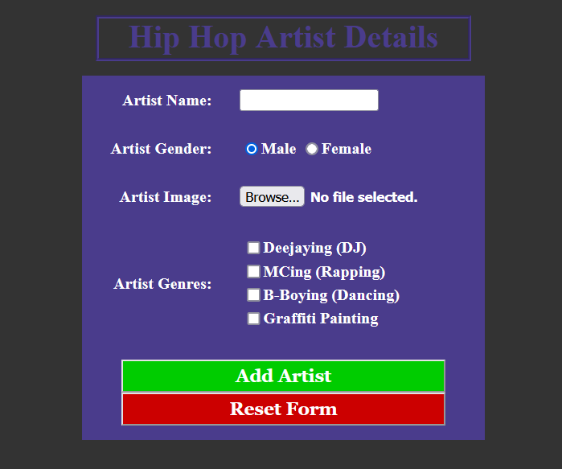
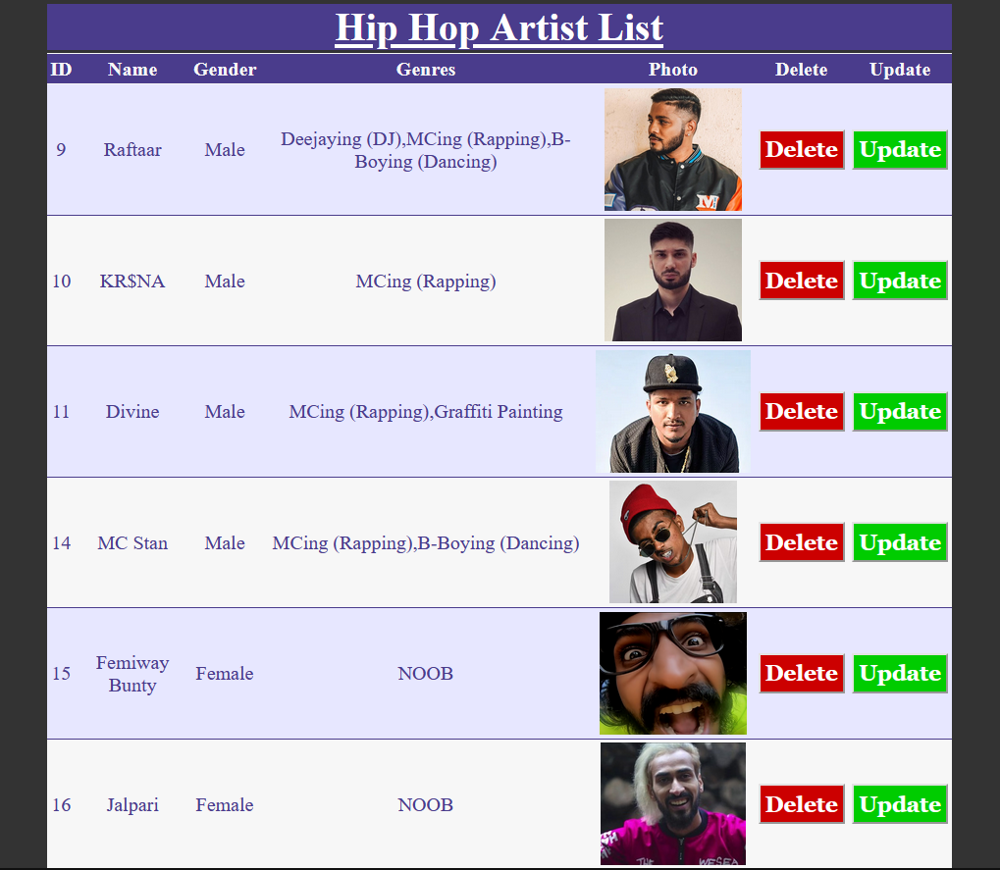
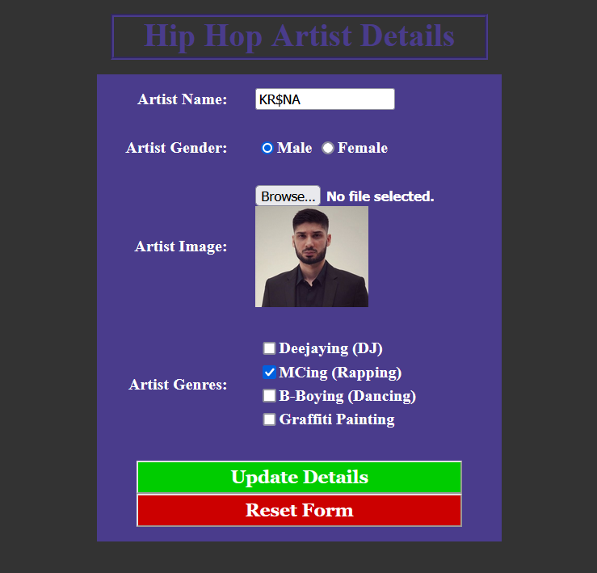

# ASP.NET CRUD Module v3
This is even better version than CRUD v2. This time we have added capability to add Images! And this time it takes input of Hip Hop Artists!

- The first TextBox accepts Artist Name
- Then after, two RadioButtons of same ButtonGroup decide Gender of the Artist [ Male / Female ]
- A FileUpload control accepts the Image that user wishes to upload!
- An ImageView is used when updating the details to preview the image they had uploaded!
- A CheckBoxList is used to accept various skills the Artists have!

# Screenshots

  
  
  

